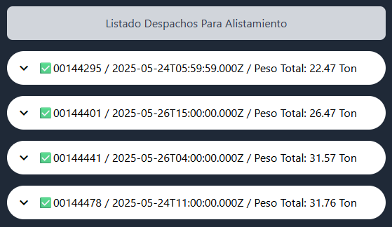
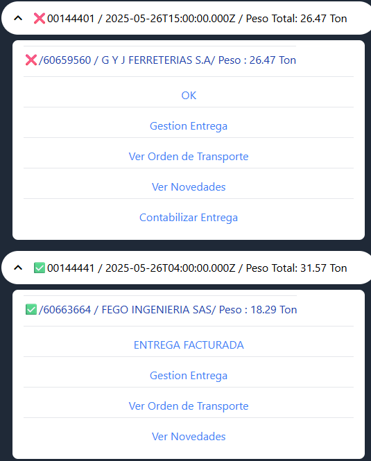
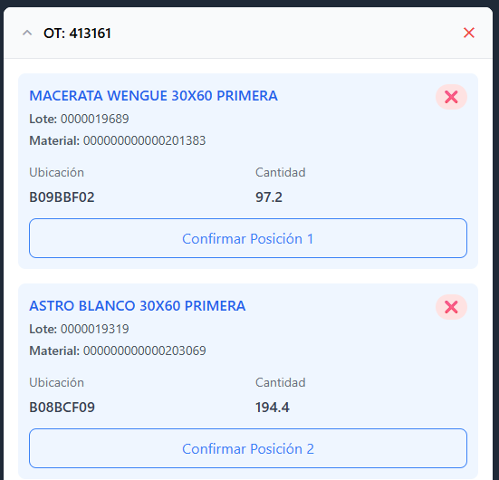
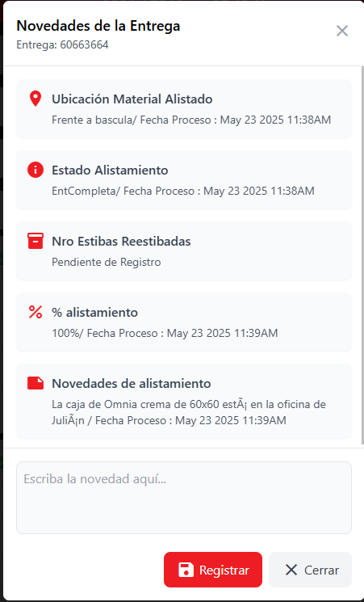

# Listado de Despachos / Alistamiento

En la sección de alistamiento (`/alistamiento`), puedes ver y gestionar los despachos pendientes asignados para tu turno de trabajo.

## Vista General

La interfaz principal muestra el **"Listado Despachos Para Alistamiento"** donde encontrarás todos los despachos que requieren preparación de materiales.

## Información de Despachos

Cada despacho se presenta en una tarjeta expandible con la siguiente información:

### Indicadores de Estado

| Icono                   | Estado     | Descripción                            |
| ----------------------- | ---------- | --------------------------------------- |
| ✅**Check verde** | Completo   | El despacho está listo en su totalidad |
| ❌**X roja**      | Incompleto | Falta material por alistar              |

### Datos del Despacho

Cada entrada muestra:

- **📋 Número de despacho**: Identificador único (ej: 00144295)
- **📅 Fecha y hora**: Programación de alistamiento (formato: AAAA-MM-DDTHH:MM:SS.000Z)
- **⚖️ Peso total**: Peso total del despacho en toneladas

### Ejemplo de Registro

✅ 00144295 / 2025-05-24T05:59:59.000Z / Peso Total: 22.47 Ton

## Sistema de Alertas

:::warning Alerta de Sobrepeso
**Despachos > 33 toneladas**: Cuando un despacho supera las 33 toneladas, el fondo de la tarjeta se muestra en **color morado** como alerta visual de sobrepeso.
:::

### Rangos de Peso

import Tabs from '@theme/Tabs';
import TabItem from '@theme/TabItem';

<Tabs>
  <TabItem value="normal" label="🟢 Normal (≤ 33 Ton)" default>

    **Fondo blanco/gris** - Peso dentro de los límites normales de operación

    Ejemplos:
    - 22.47 Ton ✅
    - 26.47 Ton ✅
    - 31.57 Ton ✅

</TabItem>
  <TabItem value="sobrepeso" label="🟣 Sobrepeso (> 33 Ton)">

    **Fondo morado** - Requiere atención especial y validación adicional

    Consideraciones:
    - Verificar capacidad del vehículo
    - Coordinar con logística
    - Validar restricciones de peso

</TabItem>
</Tabs>

## Funcionalidades Principales

### Expandir/Contraer Despachos

- **Icono de flecha** en cada despacho permite expandir para ver detalles
- **Vista compacta** por defecto para mejor navegación
- **Expansión individual** de cada despacho según necesidad

## Gestión de Entregas

Al expandir un despacho, se despliega el **listado de entregas asociadas** al mismo, cada una con funcionalidades específicas según su estado.

### Estados de Entregas

<Tabs>
  <TabItem value="ok" label="🟢 OK" default>

    **Estado**: Listo para alistar

    **Descripción**: La entrega está en óptimas condiciones para empezar a alistar

    **Condiciones**:
    - ✅ OT (Orden de Trabajo) generada
    - ✅ Materiales disponibles
    - ✅ Ubicaciones confirmadas

    **Acciones disponibles**:
    - Iniciar proceso de alistamiento
    - Consultar materiales
    - **Contabilizar** (cuando esté completa)

</TabItem>
  <TabItem value="contabilizada" label="🔵 ENTREGA CONTABILIZADA">

    **Estado**: Lista y contabilizada

    **Descripción**: La entrega está lista en su totalidad y se ha procedido a contabilizar

    **Condiciones**:
    - ✅ Alistamiento completado al 100%
    - ✅ Materiales verificados
    - ✅ Proceso contabilizado

    **Acciones disponibles**:
    - **Facturar** entrega
    - Consultar detalles
    - Ver trazabilidad

</TabItem>
  <TabItem value="facturada" label="🟣 ENTREGA FACTURADA">

    **Estado**: Procesada completamente

    **Descripción**: Estado generado después de contabilizar y ejecutar la acción de facturar

    **Condiciones**:
    - ✅ Entrega contabilizada
    - ✅ Facturación ejecutada
    - ✅ Proceso cerrado

    **Acciones disponibles**:
    - Solo consulta
    - Ver histórico
    - Generar reportes

</TabItem>
</Tabs>

## Funcionalidades por Entrega

### 1. Gestión Entrega

**Función**: Visualizar toda la trazabilidad de la entrega

**Información disponible**:

- **⏰ Tiempos**: Hora inicio y fin de alistamiento
- **👤 Personal**: Persona que alista y persona que carga
- **✅ Validaciones**: Validación del alistamiento
- **📊 Estados**: Estatus del cargue
- **📋 Historial**: Registro completo de actividades

:::tip Trazabilidad Completa
Esta función te permite hacer seguimiento completo desde el inicio hasta la finalización de la entrega, ideal para auditorías y control de calidad.
:::

### 2. Ver Orden de Transporte

**Función**: Visualizar información de la OT asociada a la entrega

**Información mostrada**:

- **🆔 Número de OT**: Identificador único (ej: OT: 413161)
- **📦 Materiales**: Lista detallada de productos
  - Nombre del material
  - Código/lote
  - Ubicación en almacén
  - Cantidad requerida
- **📍 Ubicaciones**: Códigos de ubicación específicos
- **🔘 Acciones**: Botones para confirmar posiciones

### 3. Ver Novedades

**Función**: Visualizar y registrar observaciones de la entrega

**Información disponible**:

| Novedad                                   | Descripción                    | Estado                            |
| ----------------------------------------- | ------------------------------- | --------------------------------- |
| **📍 Ubicación Material Alistado** | Ubicación física del material | Frente a báscula / Fecha proceso |
| **ℹ️ Estado Alistamiento**        | Estado actual del proceso       | EntCompleta / Fecha proceso       |
| **📦 Nro Estibas Reestibadas**      | Cantidad de estibas procesadas  | Pendiente de Registro             |
| **📊 % Alistamiento**               | Porcentaje de completitud       | 100% / Fecha proceso              |
| **📝 Novedades de Alistamiento**    | Observaciones específicas      | Texto descriptivo                 |

**Funcionalidades**:

- **✍️ Registrar nuevas novedades**: Campo de texto para observaciones
- **💾 Guardar**: Botón "Registrar" para confirmar
- **❌ Cerrar**: Salir sin guardar cambios

## Flujo de Estados y Validaciones

Validaciones

Si la entrega esta en un estado OK se ve reflejada una opcion de CONTABILIZAR

Si la entrega esta en un estado de ENTREGA CONTABILIZADA nos mostrara la opcion para facturar
