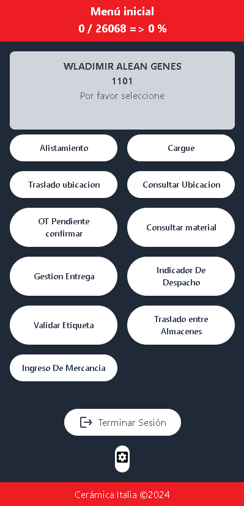
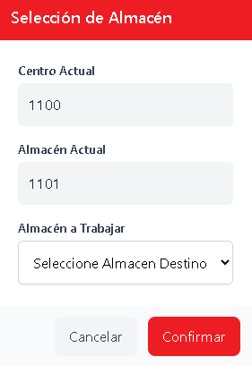

# Menú Principal

Después de iniciar sesión, accederás al menú principal (`/menu`), desde donde puedes navegar a las diferentes secciones de la aplicación.

## Indicador de Despachos

En la parte superior de la aplicación encontrarás un **indicador de despachos** que muestra los metros despachados en el día actual.

:::tip Información útil
Este indicador te ayuda a tener una perspectiva en tiempo real de la productividad diaria del almacén.
:::

## Información del Usuario

El sistema muestra la siguiente información:

- **Nombre del técnico logístico** conectado
- **Almacén** de asignación actual
- **Estado de sesión** activa

## Aplicaciones Disponibles

El menú principal presenta **9 aplicaciones** organizadas en una interfaz intuitiva:

import Tabs from '@theme/Tabs';
import TabItem from '@theme/TabItem';

<Tabs>
  <TabItem value="operaciones" label="🏭 Operaciones Principales" default>
    
    ### Alistamiento
    Gestión y preparación de materiales para despacho
    
    ### Cargue  
    Control y seguimiento de carga de vehículos
    
    ### Gestión Entrega
    Administración completa del proceso de entregas
    
  </TabItem>
  <TabItem value="ubicaciones" label="📍 Gestión de Ubicaciones">
    
    ### Traslado Ubicación
    Movimiento de materiales entre ubicaciones del almacén
    
    ### Consultar Ubicación
    Búsqueda y verificación de ubicaciones de materiales
    
    ### Traslado entre Almacenes
    Transferencia de materiales entre diferentes almacenes
    
  </TabItem>
  <TabItem value="consultas" label="🔍 Consultas y Validaciones">
    
    ### Consultar Material
    Búsqueda de información detallada de materiales
    
    ### Validar Etiqueta
    Verificación de códigos y etiquetas del sistema
    
    ### OT Pendiente Confirmar
    Revisión de órdenes de trabajo pendientes
    
  </TabItem>
  <TabItem value="reportes" label="📊 Indicadores y Reportes">
    
    ### Indicador De Despacho
    Métricas y estadísticas de despachos
    
    ### Ingreso De Mercancía
    Registro y control de entrada de productos
    
  </TabItem>
</Tabs>

## Matriz de Aplicaciones

| Aplicación | Función Principal |
|------------|-------------------|
| **📦 Alistamiento** | Preparación de materiales | 
| **🚛 Cargue** | Control de carga de vehículos | 
| **🔄 Traslado Ubicación** | Movimiento interno de materiales | 
| **📍 Consultar Ubicación** | Búsqueda de material en ubicaciones | 
| **📋 OT Pendiente Confirmar** | Gestión de órdenes pendientes | 
| **🔍 Consultar Material** | Información de productos disponible, lote, ubicacion | 
| **📊 Gestión Entrega** | Administración de entregas | 
| **📈 Indicador De Despacho** | Métricas de despachos | 
| **🏷️ Validar Etiqueta** | Verificación de Pallets | 
| **🔀 Traslado entre Almacenes** | Transferencias entre-almacén | 
| **📥 Ingreso De Mercancía** | Control de entradas | 

## Controles del Sistema

### Gestión de Sesión

| Control | Ubicación | Función |
|---------|-----------|---------|
| **Cerrar Sesión** | Inferior izquierda | Termina la sesión de forma segura |
| **Configuración** ⚙️ | Inferior derecha | Cambiar almacén de trabajo |

:::warning Cambio de almacén
Al cambiar de almacén, se actualizarán todos los datos y contexto de trabajo. Asegúrate de completar las tareas pendientes antes del cambio.
:::

